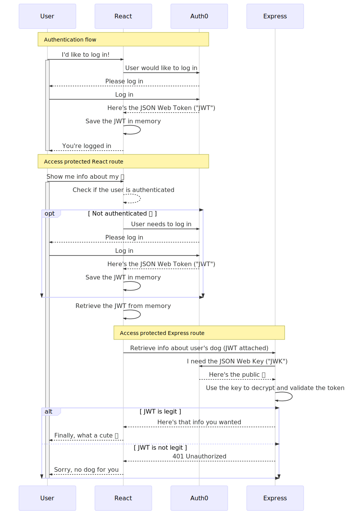

# Auth0 With React and Express Example

Demonstrate the [OAuth 2.0 implicit flow][implicit flow] with [Auth0][], React
client, and Express API server.

This example follows the [Auth0 React quickstart tutorial][quickstart], follow
along for step-by-step instructions.

## What is implicit flow?

The key idea is that the client (React) acquires a JSON Web Token ("JWT") from
a central authentication service (Auth0). The token proves that the user is
logged in, and serves as the user's ID (think of an encrypted driver's
license).

The JWT can then be used as proof of authentication everywhere (in this case,
to React and to Express). This example contains the following flows:

## Encryption

JWTs need to be encrypted, so they can't be forged or tampered with. This is
done using public-key (also known as asymmetric) cryptography. [Read this
article][keys] for a high level explanation.

JSON Web Key ("JWK") is the mechanism through which public keys are
distributed. [Read this article][JWK] for more info.

## More info

* [React app README](app/README.md)
* [Express API server README](server/README.md)

[Auth0]: https://auth0.com
[JWK]: https://auth0.com/docs/jwks
[implicit flow]: https://auth0.com/docs/flows/concepts/implicit
[keys]: https://www.comodo.com/resources/small-business/digital-certificates2.php
[quickstart]: https://auth0.com/docs/quickstart/spa/react
