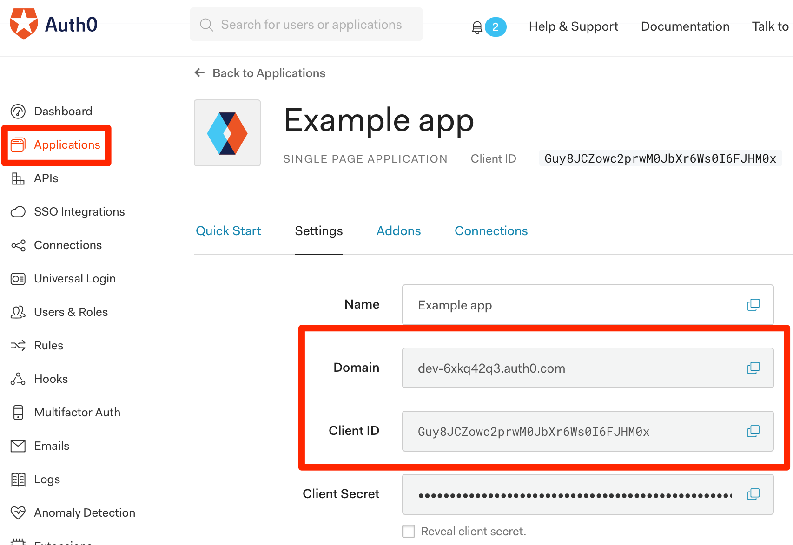
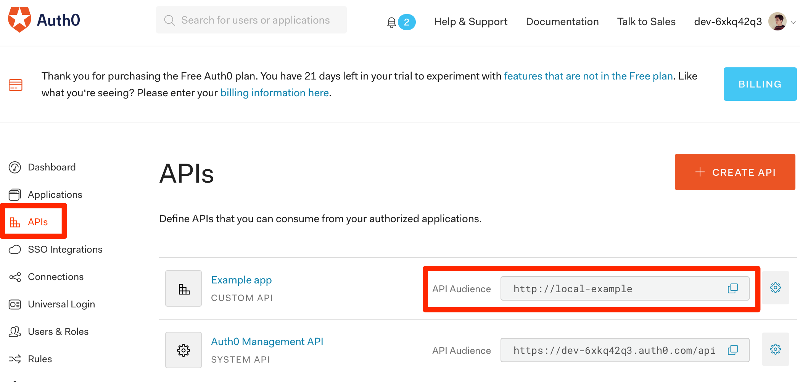

# Express API Server

Follow along step-by-step at
<https://auth0.com/docs/quickstart/spa/react/02-calling-an-api>.

This technique doesn't just apply to Express, you can use it for any kind of
backend, including serverless, that requires authentication via client-acquired
JWT.

## Where do I find the values for `server.js#authConfig`?

### `domain`

1. Click on "Applications."
1. Click on the application that you created in the tutorial.
1. Copy and paste from "Domain":
   

### `audience`

1. Click on "APIs."
1. Copy "API Audience" from the API that you created.
   
